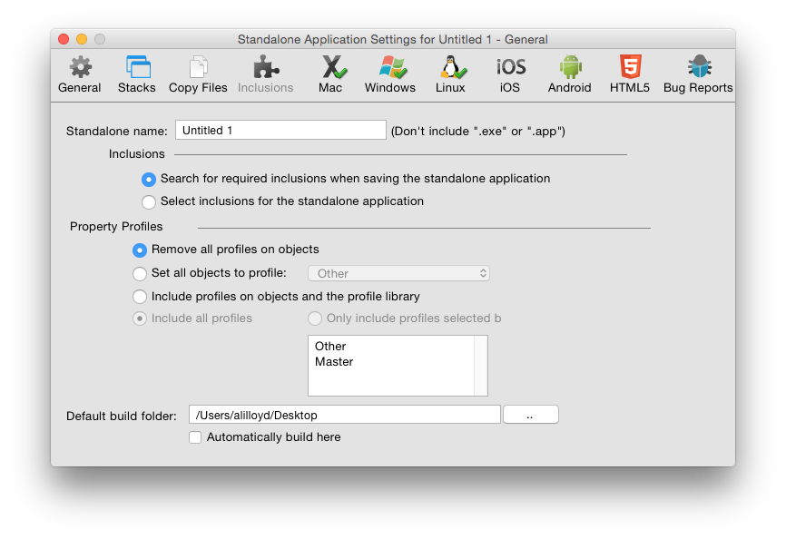
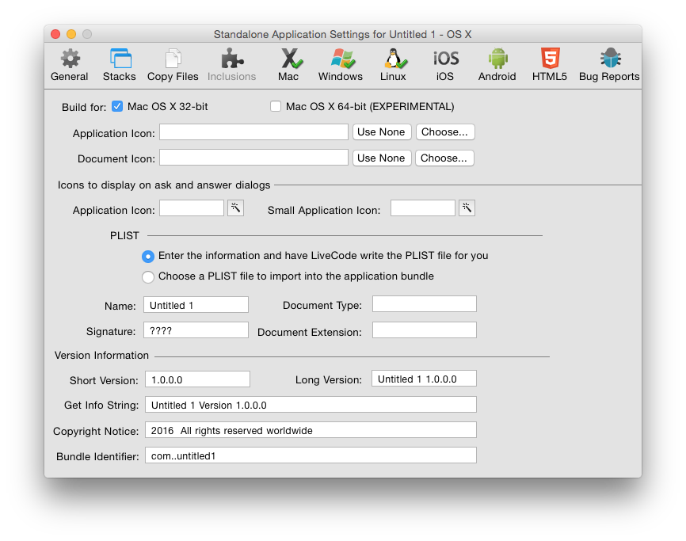
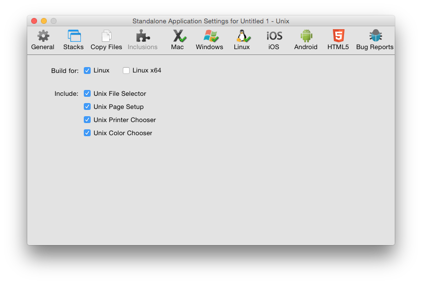

# Deploying Your Application

## Introduction

With LiveCode, it is easy to deploy your application to anyone.

Using the standalone building capability in LiveCode you can create a native desktop 
application for each operating system you want to support. Users who do not have LiveCode 
can run these applications like any other application they download and install. 
Standalone applications can have their own identity as true applications, include a 
desktop icon, document associations and more.

You can also create applications for iOS, android, and HTML5. Please consult the separate
guides for information on how to deploy to these platforms.

## Building a Standalone Application

When you have finished your LiveCode application and what to distribute it you can build 
it into a standalone application. These applications do not require users to have LiveCode.
All of LiveCode's feature set is available for use in a standalone application, with the 
exception that you cannot set scripts on objects.

The builder itself will let you build standalone applications for any platform it supports, 
from any platform it supports (for example you can build a Windows standalone on a Mac OS 
X machine). However, you may wish to check that your application looks and behaves correctly 
on each platform you intend to support. Please note it is inherently harder to debug an 
application that has been built as a standalone, so you should test your application as 
thoroughly as possible before building it.

### Standalone Applications Settings

The Standalone Applications Setting dialog allows you to create settings for your 
standalone application. This dialog can be found in the File menu. The settings you enter 
are applied to the current front most editable stack and are saved with the stack. This 
means you only need to enter the settings once for each application you create. The same 
settings will apply if you do another build in the future.

Figure 1 – Standalone Settings – General Tab

| &nbsp;| &nbsp;|
|-------------------------|---------------------------------------------------------------------------------------------------------------------------------------------------------------------------------------------------------------------------------------------------------------------------------------------------------------------|
| **Mode Selector**       | Choose between the different standalone application settings screens.                                                                                                                                                                                                                                               |
| **Standalone Name**     | Set the name of your standalone application. This should be the name you want your finished application to have. Don’t include a file extension (.exe on Windows or .app on Mac OS X) as the standalone builder can create standalones for multiple platforms and will add the appropriate extension automatically. |
| **Inclusions Selector** | Choose the components you want to include in a standalone. You may either choose to search for required inclusions automatically, or manually select the components you want to include.                                                                                                                            |

**Search for Inclusions**

This is the default option. When selected, LiveCode will search your application stack file 
(main stack and sub stacks) to attempt to determine what components your application uses. 
It will then include those items.

**Select Inclusions for the Standalone Applications**

Select this option if you want to specify the components to include manually. You may wish 
to use this option if your application dynamically loads components that cannot be searched 
at this point automatically, or if you know exactly what components your application uses 
and wish to speed up the standalone building process by skipping the automatic search step.

It is important that you choose to include all the components that your application uses 
or it may fail. If you do not include your own custom error reporting or LiveCode’s 
standalone error reporting dialog (discussed below) such failure may be silent – i.e. an 
operation in your standalone will simply cease working without displaying anything to the 
user.                                                                                                                                                                                                                                                                                                                                                                                                                                                                                                                                                                                                                                                                                                                                                                                                                                                                                                                                                                                                                                     |

| &nbsp;| &nbsp;|
|----------------------------------------------|----------------------------------------------------------------------------------------------------------------------------------------------------------------------------------------------------------------------------------------------------|
| **Profiles Settings**                        | Choose between the Property Profile settings options. You only need to alter settings in this area if you have used Property Profiles (see the section on *Property Profiles* in Chapter 4, Builder a User Interface above)                        |
| **Remove all profiles**                      | Removes all profiles and builds the standalone using the currently active profile on each object. Select this option if you don't need to change profile in the standalone and want to save disk space by removing extraneous profile information. |
| **Set all objects to profile**               | Set all objects to a specific profile then remove the profile data from objects.                                                                                                                                                                   |
| **Include profiles and the profile library** | Include the profile library and allow switching between profiles in the standalone application. You can choose whether to include specific profiles or all profiles.                                                                               |

Figure 2 – Standalone Settings – Stacks Tab

| &nbsp;| &nbsp;|
|------------------------------------------|-----------------------------------------------------------------------------------------------------------------------------------------------------------------------------------------------------------------------------------------------------------------------------------------------------------------|
| **Stack Files**                          | Use this section to add additional stack files to your application. Any stacks you add to this section will be added to the `stackFiles`property of the main stack of your standalone. This means that any scripts within your standalone application will be able to locate and reference these stacks by name. |
| **Advanced Options**                     | Use this section to control exactly how multiple stack files are managed in your standalone.                                                                                                                                                                                                                    |
| **Move substacks into individual files** | If you select this option, each of the sub stacks in the stack files you select will be moved into their own individual file, located in the data folder or within the application bundle of your standalone.                                                                                                   |
| **Rename stackfiles generically**        | Renames each sub stack file using a number on disk (instead of using the name of the sub stack). Select this option if you do not want the names you have selected for stacks to be visible to the end user in the filing system.                                                                               |
| **Create folder for stackfiles**         | Creates a folder and places the stack files into that folder, instead of storing them at the same level as the standalone executable. All references in the `stackFiles`property will refer to this folder using a relative path so the stacks can still be located by the standalone application.               |
| **Individual stack options**             | Select a stack file on the left then an individual stack from within the file to set options on that stack.                                                                                                                                                                                                     |
| **Set destroyStack to true**             | Set this option if you want the selected stack file to be removed from memory when it is closed. This option is useful if you are loading large stacks into memory and want them to be removed when they are closed.                                                                                            |
| **Encrypt with password**                | Secures the scripts within the selected stack file with a password. This provides a basic level of encryption that prevents someone from casually reading the scripts in the stack by opening the file in a binary file viewer.                                                                                 |

> **Note:** A stack file directly attached to a standalone application cannot have changes
saved to it. This stack is bound directly to the executable file that runs. The OS locks 
an executable file while it is running. If you want to save changes in your standalone 
application, split your stack up until multiple files. A common technique is to create a 
"splash screen" stack that contains a welcome screen and then loads the stacks that make 
up the rest of your application. These stacks are referenced as `stackFiles`on this pane 
in the standalone settings screen. It is thus possible to automatically update these 
component stacks, or to save changes to them. You may also want to consider creating 
preference files in the appropriate location on your end user's system (see the 
`specialFolderPath`function and query/setRegistry functions for more information).

Figure 3 – Standalone Settings – Copy Files

| &nbsp;| &nbsp;|
|----------------------------------------|------------------------------------------------------------------------------------------------------------------------------------------------------------------------------------------------------------------------------------------------------------------------|
| **Non-stack files in the application** | List other files to be included in the standalone. Use this feature to include help documents, read me files and other resources that you want to include with your standalone each time you build.                                                                    |
| **Copy Referenced Files**              | Loops over all image and player objects in stacks and copies any files referenced in the `fileName`property of these objects into the standalone. Then automatically sets the `fileName`property to reference these files in the standalone using referenced file paths. |
| **Destination folder**                 | Create a subfolder within your standalone to copy the image and movie files to.                                                                                                                                                                                        |
| **Extensions**						 | Select the extensions you wish to include in the standalone.

Figure 4 – Standalone Settings – Inclusions

The list of resources available to select for inclusion in a standalone
application are a combination of currently installed LiveCode Builder
extensions, externals and database drivers (both built-in and those 
found in user folders), and built-in resources and script libraries.

The following built-in resources are available by default:

| &nbsp;| &nbsp;|
|----------------------|-------------------------------------------------------------------------------------------------------------------------------------------------------------------------------------------------------------------------------------------------------------------------------------------------------------------------------------------------------------------------------------------------------------------------------------------------------------------------------------------------------------------------------------------------------------------------------------------------|
| **Ask Dialog**       | This option is required if any of your scripts use the "ask" or "ask password" commands. The standalone builder will copy the stack "ask dialog" from the IDE into your standalone as a sub stack. The standalone builder makes a copy of your stack before adding resources to it as part of the build process, so your original stack is unaltered.                                                                                                                                                                                                                                           |
| **Answer Dialog**    | This option is required if any of your scripts use the "answer" command. Note that this only applies to the dialog form of the command. The answer file / printer / color / effect / folder / page setup / printer and record forms of the command do *not* require this option. The standalone builder will copy the stack "answer dialog" into your standalone.                                                                                                                                                                                                                               |
| **Browser**   	   | This option is required if your application uses the embedded browser or any `revBrowser` command.                                                                                                                                                                                                                                                                                                                                                                                                                                                                                              |
| **Browser (CEF)**    | This option is required if your application uses the embedded CEF browser or any `revBrowser` command.                                                                                                                                                                                                                                                                                                                                                                                                                                                                                          |
| **Brushes**          | This option is required if your application uses any of LiveCode's brush cursors. It is not required if your application does not make use of the painting commands. It copies the stack "brushes" into your standalone.                                                                                                                                                                                                                                                                                                                                                                        |
| **Cursors**          | This option is required if your application uses any of LiveCode's cursors. It is not required if your application only uses OS cursors. It copies the stack "cursors" into your standalone.                                                                                                                                                                                                                                                                                                                                                                                                    |
| **Database**         | This option is required if your application uses database access or any `revDatabase` command.                                                                                                                                                                                                                                                                                                                                                                                                                                                                                                  |
| **Magnify**		   | This option is required if your application uses the magnify palette.                                                                                                                                                                                                                                                                                                                                                                                                                                                                                                                           |
| **PDF Printer**      | This option is required if your application uses the "open printing to pdf" command.                                                                                                                                                                                                                                                                                                                                                                                                                                                                                                            |
| **Print Dialog**     | This option is required if your application uses LiveCode's built-in print or page setup dialogs (e.g. for use on Linux without GTK installed). It is not required if you only display the system printer and page setup dialogs. It copies the stack "print dialog" and "page setup" into your standalone.                                                                                                                                                                                                                                                                                     |
| **SSL & Encryption** | This option is required if your application uses any SSL or encryption related commands                                                                                                                                                                                                                                                                                                                                                                                                                                                                                                         |
| **Video Grabber**    | This option is required if your application uses any video capture commands                                                                                                                                                                                                                                                                                                                                                                                                                                                                                                                     |
| **XML**              | This option is required if your application uses any `revXML` commands                                                                                                                                                                                                                                                                                                                                                                                                                                                                                                                          |

The following script libraries are available by default:

| Library Name | Automatic inclusion condition |
|----------------------|----------------------------------------------------------------------|
| **Animation** 	   | This library is unsupported.                                         |
| **DataGrid**         | DataGrid object.                                                     |
| **Geometry**         | Geometry properties or commands.                                     |
| **Internet**         | Internet access, including URL, ftp & POST                           |
| **Printing**         | `revPrintField`, `revShowPrintDialog` and `revPrintText`             |
| **Zip**              | All `revZip` commands (but not required for `compress`/`decompress`) |
| **Speech**           | `revSpeak` and revSpeechVoices                                       |
| **Table**            | Use of the table object                                              |
| **XMLRPC**           | Any `revXMLRPC` commands                                             |

The following database drivers are available by default:

- ODBC
- MySQL
- SQLite
- PostgreSQL

Figure 5 – Standalone Settings – Mac

| &nbsp;| &nbsp;|
|-----------------------------------------------------------------|-------------------------------------------------------------------------------------------------------------------------------------------------------------------------------------------------------------------------------------------------------------------------------------------------------------------------------------------------------------------------------------------------------------------------------|
| **Build for Mac OS X 32-bit**                                   | Build a standalone that will run natively on Mac OS X Intel machines. This standalone will not run at all under PowerPC.                                                                                                                                                                                                                                                                                                      |
| **Build for Mac OS X 64-bit**                                   | Build a standalone that will run natively on Mac OS X Intel machines. This standalone will not run at all under PowerPC.                                                                                                                                                                                                                                                                                                      |
| **Application Icon**                                            | Choose an application icon to represent the application in the Finder. The icon should be in icns format.                                                                                                                                                                                                                                                                                                                     |
| **Document Icon**                                               | Choose a document icon to represent your application's documents in the Finder. The icon should be in icns format.                                                                                                                                                                                                                                                                                                            |
| **Icons for ask / answer dialogs**                              | Choose an icon to display whenever you use the ask or answer commands to display a dialog. On Mac OS X, the convention is that these dialogs should display your application icon. The icon should be stored in your stack as an image, or selected from LiveCode's built-in icons. If you have used a built-in icon, be sure to select the relevant inclusion on the General tab (if you are selecting inclusions manually). |
| **PLIST – enter information and have LiveCode write the PLIST** | Have LiveCode fill out the PLIST for your application automatically. The PLIST is a settings file stored in XML format stored as part of every Mac OS X application. It contains information about the application, including its name, version number, copyright notice and document associations. Having LiveCode create this file for you is the recommended option. For more information about PLISTs consult [Apple's developer documentation](http://developer.apple.com/documentation/Darwin/Reference/ManPages/man5/plist.5.html)|
| **Choose a file to import into the application bundle**         | Choose to import a PLIST file instead of having LiveCode create one. Select this option if you have created your own highly customized PLIST that you want to use for your application in each build you create.                                                                                                                                                                                                              |
| **Short version / long version**                                | The version information to be included with your standalone.                                                                                                                                                                                                                                                                                                                                                                  |
| **Get info string**                                             | The visible text displayed in your application's Get Info window by the Finder.                                                                                                                                                                                                                                                                                                                                               |
| **Copyright notice**                                            | The copyright notice for your application.                                                                                                                                                                                                                                                                                                                                                                                    |
| **Bundle identifier**                                           | A unique identifier for your application used by Mac OS X to identify your application.                                                                                                                                                                                                                                                                                                                                       |

Figure 6 – Standalone Settings – Windows

| &nbsp;| &nbsp;|
|-------------------------|----------------------------------------------------------------------------------------------------------------------------------------------------------------------------------------------------------------------------------------------------------------------------------|
| **Build for Windows**   | Build a standalone for the Microsoft Windows OS.                                                                                                                                                                                                                                 |
| **Application icon**    | Choose an application icon to represent the application in Windows. The icon should be in .ico format.                                                                                                                                                                           |
| **Document icon**       | Choose a document icon to represent your application's documents in Windows. The icon should be in .ico format.                                                                                                                                                                  |
| **Version information** | The version information to be stored as part of your application and displayed in the Windows property inspector and dialogs.                                                                                                                                                    |
| **UAC Execution Level** | Select the user account control level that applies to your application. For more information, consult [MSDN](https://msdn.microsoft.com/en-us/library/bb384608.aspx)                                                                                                             |

Figure 7 – Standalone Settings – Linux

| &nbsp;| &nbsp;|
|---------------------------------|--------------------------------------------------------------------------------------------------------------------------------------------------------------------------------------------------------------------------------------------------------------|
| **Build for Linux**             | Build a standalone for 32-bit Linux                                                                                                                                                                                                                          |
| **Build for Linux x64**         | Build a standalone for 64-bit Linux                                                                                                                                                                                                                          |
| **Include**                     | Select built-in LiveCode dialogs to include. These dialogs are useful if your application may be run on a system that does not include these dialogs as part of the OS. You do not need to include these dialogs if you are running a recent version of GTK. |

Figure 8 – Standalone Settings – Bug Reports

| &nbsp;| &nbsp;|
|---------------------------------------|--------------------------------------------------------------------------------------------------------------------------------------------------------------------------------------------------------------------------------------------------------------------------------------------------------------------------------------------------------------------------------------------|
| **Include Error Reporting Dialog**    | Include an error reporting stack in your standalone. You should select this option if you are testing your application and want details of any errors in your standalone, or if you have not included your own error reporting routines in your stacks.                                                                                                                                    |
| **htmlText for dialog**               | The text to display to the user in the dialog that comes up when an error is encountered. This text should be in LiveCode-compatible HTML format. Create and format the text in a LiveCode field then copy the field's HTMLText property.                                                                                                                                                  |
| **Dialog icon**                       | The icon to display in the error dialog. This should be stored as an image in your stack.                                                                                                                                                                                                                                                                                                  |
| **Allow user to enter comments**      | Display a box for the user to give you more information. This information will be included in the report.                                                                                                                                                                                                                                                                                  |
| **Allow user to save report to file** | Allow the user to save the report to a file. Select this option if you want users to save an error report and send it to you.                                                                                                                                                                                                                                                              |
| **Allow user to email report**        | Allow the user to email the report. Select this option if you want the user to be able to send you or your technical support department details of the error. This option loads up the system default email client and populates the email with the contents of the error report and the user's comments. The To: field is sent to the email address specified in the email address field. |